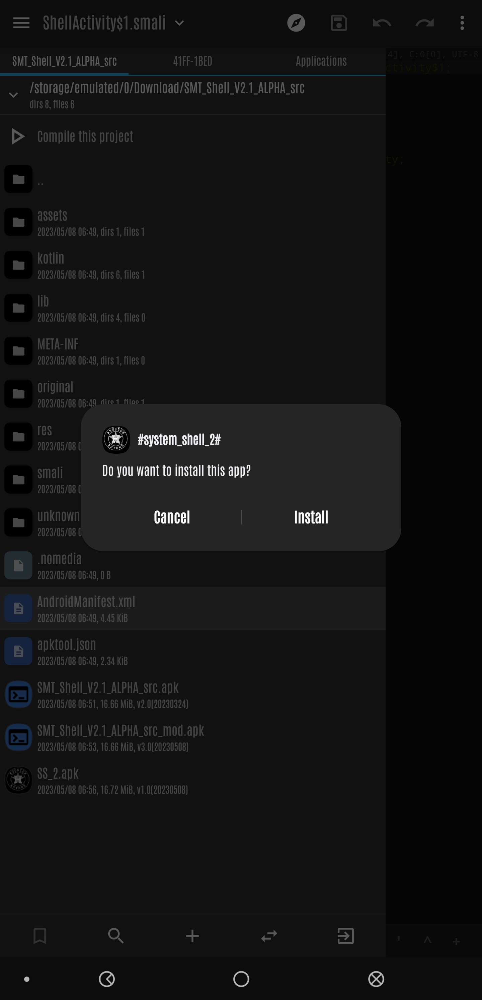

#      #system_shell_2#


A comedic twist to BLuFeNiX's SMT Shell (https://github.com/BLuFeNiX/SMTShell/)

Fully adapted and updated with new *bypass* to combat Samsung's One UI 5.1 PATCH for downgrading "SMT" that was introduced in February.

<div align="center">
    
     
     
</div>

But now dead on any firmware with a security patch of May 1, 2023, due to the framework changes AOSP
made most recently. (https://android.googlesource.com/platform/frameworks/base/+/33940a9749666eec991904094ccf56ae4ca4ae10)
      


 ##   CREDITS

#### APP & API
     BLuFeNiX (https://github.com/BLuFeNiX/) 
     SMT SHELL (https://github.com/BLuFeNiX/SMTShell/)
     SMT SHELL API (https://github.com/BLuFeNiX/SMTShell-API/)
    
    
 *Thanks for the challenge, still dont know what im doing, but I'm getting there.*
 *Appreciate your time and patience*


### *NEW* Method for *Bypassing* One UI 5.1 Patch
     New bypass was made possible by the intense research and dedication of one person and that is
     K0mRaid3! (https://twitter.com/k0mraid3). FULL CREDIT goes to him and on his discovery for bypassing 
     the ASKSManager and introducing a new tool/arg, to help in the fight with Samsung.
     
     BYPASS METHOD discovered by K0mRaiD for Samsung Devices that have a security patch of APRIL 1, 2023 or earlier 
               (THIS DOES NOT COUNT FOR WATCHES, KOREAN OR INDIAN VARIANT DEVICES!)
     
        "   pm install -d -i "com.sec.android.preloadinstaller" /path/to/vuln/SMT   "
   


## Usage (with Shizuku)

Simply run the app and grant Shizuku access.

## Usage (no Shizuku)

1. Downgrade the TTS app to [the version provided](https://raw.githubusercontent.com/BLuFeNiX/SMTShell/master/smtshell/app/src/main/assets/com.samsung.SMT_v3.0.02.2.apk) (this must be done after every reboot):
```
adb install -d com.samsung.SMT_v3.0.02.2.apk
```
Alternatively, you can use `pm install -d /data/local/tmp/com.samsung.SMT_v3.0.02.2.apk` if you copy the file to your device first, via `adb push`

2. Install and open the SMT Shell app, and follow the prompts.

## Licences & Origin

This project started as a fork of [SMT-CVE-2019-16253](https://github.com/flankerhqd/vendor-android-cves/tree/master/SMT-CVE-2019-16253), created by flankerhqd (AKA flanker017). There is also a write-up by flanker [here](https://blog.flanker017.me/text-to-speech-speaks-pwned). Due to the original repo containing multiple unrelated projects, this fork's git history was rewritten using `git filter-repo` so that it only contains the relevant code (and no prebuilt artifacts).

This repo will continue to use the LGPL license that the original used when this fork was created. Other embedded components are licensed as follows:

### Shizuku - Copyright (c) 2021 RikkaW

Some code was copied or adapted from the [Shizuku API](https://github.com/RikkaApps/Shizuku-API) demo project, which is distributed under the MIT License. Primarily, this includes files in `smtshell/app/src/main/java/com/samsung/SMT/lang/smtshell/shizuku`, and the hidden API class stubs in `smtshell/hidden-api-stub`. A copy of the license can be found [here](https://github.com/RikkaApps/Shizuku-API/blob/master/LICENSE).

### Samsung

This project includes an unmodified Samsung APK, at `./smtshell/app/src/main/assets/com.samsung.SMT_v3.0.02.2.apk`.

### Changes from the original

Please see the git commit history for a comprehensive list of changes. Essentially everything was changed, and only the original exploit research remains in spirit.
